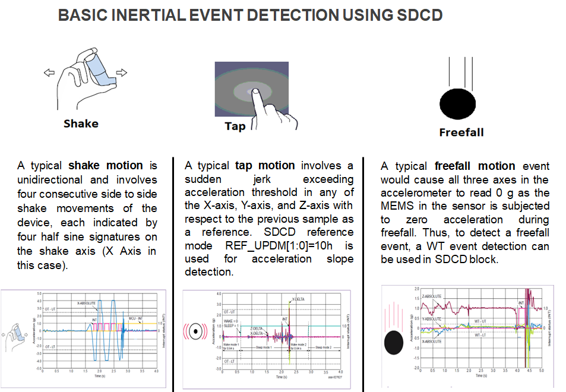

# NXP Application Code Hub

## AN12004: Low-Power Motion Wake-Up Examples for FXLS8974CF using Sensor Data Change Detection (SDCD) Block

- This software describes how to configure SDCD block of FXLS897xCF sensor to enable low-power motion wake-up in interrupt mode and use auto-wake/sleep feature to autonomously
put the sensor back to low-power sleep mode when no-motion is detected for configured auto-sleep timer.

- Please refer to AN12004 for more information on FXLS8974CF SDCD function.  
  https://www.nxp.com/docs/en/application-note/AN12004.pdf

- The Sensor Data Change Detection (SDCD) block of FXLS89xx is an efficient and flexible inertial event detection function with the ability to detect inertial events such as motion/no-motion,
high-g/low-g, tap, freefall and transient acceleration events, etc.
- The SDCD function within FXLS89xx incorporates a flexible digital window comparator useful for implementing several different
interrupt event generation functions. Simply stated, the acceleration data input to the SDCD block is compared against a set of user programmable upper and lower thresholds in absolute or relative mode.

- The image below shows the basic inertial motion events detections using SDCD.

    

- #### Boards: FRDM-MCXN947, MCX-N9XX-EVK
- #### Accessories: nxp_frdm_stbi_a8974, mikroe_accel_4_click
- #### Categories: Low Power, Sensor
- #### Peripherals: I2C, SPI, UART
- #### Toolchains: MCUXpresso IDE

## Table of Contents
1. [Software](#step1)
2. [Hardware](#step2)
3. [Setup](#step3)
4. [Results](#step4)
5. [Support](#step5)

## 1. Software
- IoT Sensing SDK (ISSDK) v1.8 offered as middleware in MCUXpresso SDK for supported platforms (https://nxp.com/iot-sensing-sdk)
- MCUXpresso SDK v2.13.1 for MCX-N9XX-EVK (https://mcuxpresso.nxp.com/en/select)
- MCUXpresso IDE v11.9.0
- Git v2.39.0
- Teraterm (https://osdn.net/projects/ttssh2/releases/) or RealTerm (https://sourceforge.net/projects/realterm/)

## 2. Hardware
- FRDM-MCXN947 or MCX-N9XX-EVK MCU board
- FRDM-STBI-A8974 sensor board (https://mcuxpresso.nxp.com/eb-hub/product/frdm-stbi-a8974) Or
- Accel4 sensor click (https://www.mikroe.com/accel-4-click)
- Personal Computer
- Mini/micro C USB cable

## 3. Setup

### 3.1 Step 1: Download and Install required Software(s)
- Install MCUXpresso IDE 2.19.0
- Download and Install MCXUpresso SDK 2.13.1 for MCX
- Install Git v2.39.0 (for cloning and running west commands)
- RealTerm (for checking examples output)

### 3.2 Step 2: Clone the APP-CODE-HUB/an-fxls8974cf-low-power-wake-up-examples
- Clone this repository to get the example projects:
- Change directory to cloned project folder: 
    cd *an-fxls8974cf-low-power-wake-up-examples*

### 3.3 Step 3: Build example projects
- Open MCUXpresso IDE and select a directory to create your workspace.
- Install MCXUpresso SDK 2.13.1 for MCX (drag and drop SDK zip into "Installed SDK" view) into MCUXpresso IDE.
- Go to "Quickstart Panel" and click on "Import Project(s) from file system",
- Select "Project directory (unpacked)" and browse to the cloned project folder.
- Select example projects that you want to open and run.
- Right click on project and select build to start building the project.

### 3.4 Step 4: Run example projects
- Connect the chosen example project HW: FRDM-MCXN947 or MCX-N9XX-EVK with FRDM-STBI-A8974 or Accel4 click.
- Right click on project and select "Debug As". Select MCUXpresso IDE LinkServer (inc. CMSIS DAP) probes.
- Connect a USB cable between the host PC and the MCU-Link USB port on the target board.
- Open a serial terminal (RealTerm) with the following settings:
    - 115200 baud rate
    - 8 data bits
    - No parity
    - One stop bit
    - No flow control
- Download the program to the target board.
- Either press the reset button on your board or launch the debugger in your IDE to begin running the demo.

## 4. Results
- Show the <motion> on the board up to detect motion event. Refer to example project doc/readme.txt for more details.
- When the demo runs successfully, you can see the Samples printed to the terminal.

    *ISSDK FXLS8974CF Example: Wake-Up on Motion Detection & Auto Wake/Sleep*  
    *Successfully Initialized Timandra with WHO_AM_I = 0x86*  
    *Successfully Applied FXLS8974 SDCD Configuration for Motion Detection*  

    *ASLP (Auto Sleep) counter expired....*  
    *Sensor Operating Mode Transitioned to Sleep Mode....SYSMODE = 2*  
    *Putting MCU in low power sleep*  

    *Motion Motion Detected by Sensor SDCD Block....*  
    *Sensor Operating Mode Transitioned to Wake Mode....SYSMODE = 1*  
    *MCU Woke-up on Tap Motion Event*  
    *Will enter sleep mode after expiration of ASLP counter = ~5sec*  

    *ASLP (Auto Sleep) counter expired....*  
    *Sensor Operating Mode Transitioned to Sleep Mode....SYSMODE = 2*  
    *Putting MCU in low power sleep*

## 5. Support
- Reach out to NXP Sensors Community page for more support - [NXP Community](https://community.nxp.com/t5/forums/postpage/choose-node/true?_gl=1*fxvsn4*_ga*MTg2MDYwNjMzMy4xNzAyNDE4NzM0*_ga_WM5LE0KMSH*MTcwMjQxODczMy4xLjEuMTcwMjQxODczNi4wLjAuMA..)
- For more details on FXLS8974CF SDCD block, refer to the application note - [AN12004](https://www.nxp.com/docs/en/application-note/AN12004.pdf)
- Learn more about FXLS8974CF 3-axis accelerometer, refer to - [FXLS8974CF DS](https://www.nxp.com/docs/en/data-sheet/FXLS8974CF.pdf)
- Accelerate your sensors development using Sensor ToolBox, refer to - [Sensors Development Ecosystem](https://www.nxp.com/design/design-center/software/sensor-toolbox:SENSOR-TOOLBOXX)

#### Project Metadata
<!----- Boards ----->
 

<!----- Accessories ----->
 

<!----- Categories ----->
 

<!----- Peripherals ----->
  

<!----- Toolchains ----->

Questions regarding the content/correctness of this example can be entered as Issues within this GitHub repository.

## 7. Release Notes
| Version | Description / Update                           | Date                        |
|:-------:|------------------------------------------------|----------------------------:|
| 1.0     | Initial release on Application Code Hub        | December 29th 2023 |
